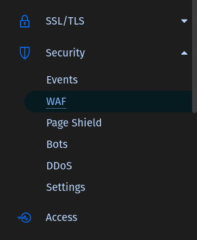
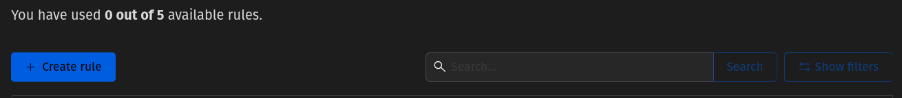
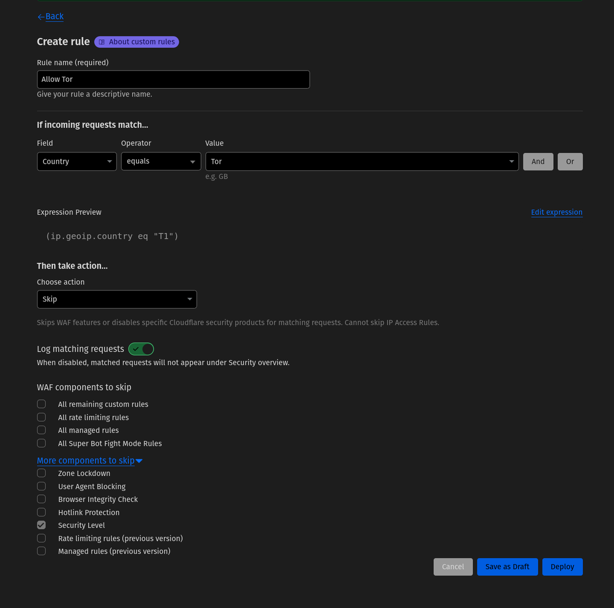
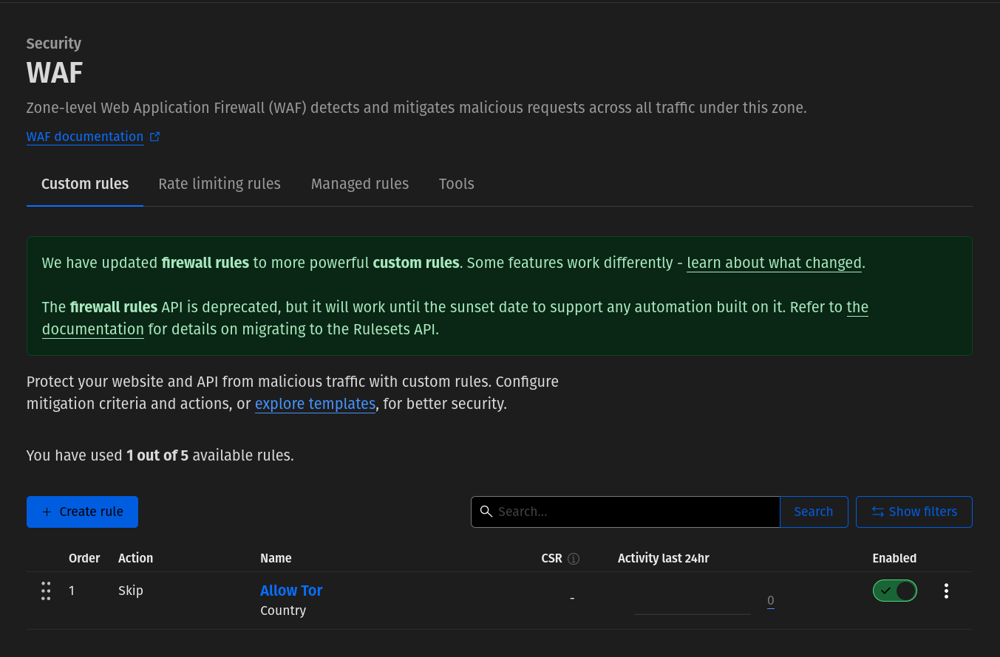

Dear Website owner,

If you protect or just hide your web-server IP using Cloudflare, please ask yourself these 3 questions:

- Do you respect privacy of your online visitors?
- Do you want to make the Internet a better place?
- Are you a wise person in general?

If **YES**, please consider allowing Tor users to visit your site.

By default, Cloudflare forces Tor users to solve Google reCaptcha - the all-in-one evil of the nowadays Internet, which ruins any user experience and demotivates one to use the Internet once forever.

If you don't want your Tor users to struggle that fate, please make a few simple changes to your Cloudflare configuration as described below.

Log-in to your Cloudflare account right now and select your site's domain, then:

1. Expand '**Security**' in the left-hand menu and select '**WAF**'

2. Click '**+ Create Rule**' button

3. Fill in the form with the following:

Form field | Value
---|---
Rule name (required) | `Allow Tor`
*If incoming requests match…* | 
Field | `Country`
Operator | `equals`
Value | `Tor`
*Then take action...* | 
Choose action | `Skip`
Click *More components to skip* | 
Security Level | `checked`

4. Click '**Deploy**' button

It's done! You deserve a lot of respect now and your site popularity will grow in no time.

Thank you very much for supporting the Tor users community and the Internet privacy!
